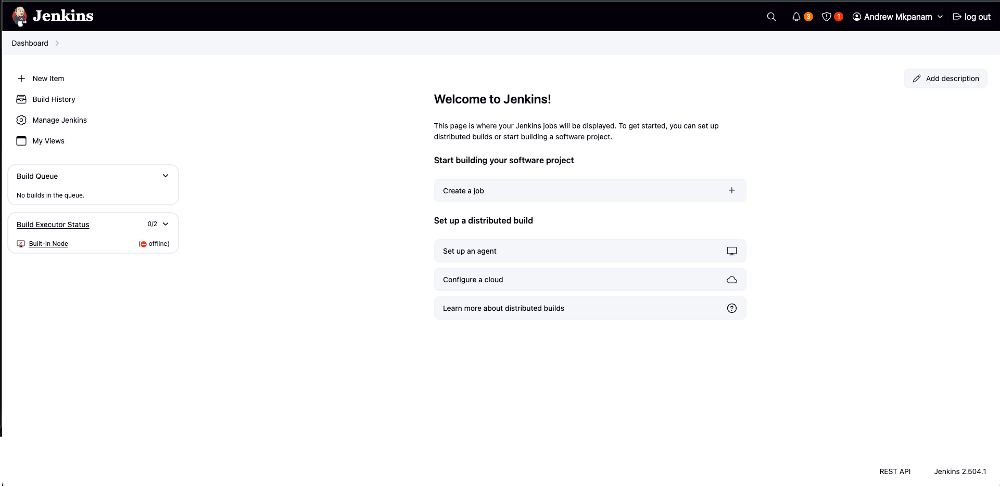

# jenkins2025

## Jenkins Server Setup
### Jenkins Installation

To Install Jenkins the following steps were taken
1. Spun up an EC2 Server on AWS
2. Allowed Network access to the internet on ports 22, and 8080
3. Updated package reporisoties
4. installed java jdk
5. installed jenkins

6. 
