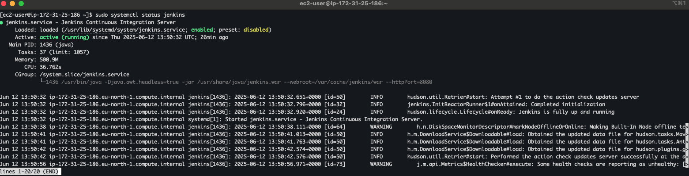
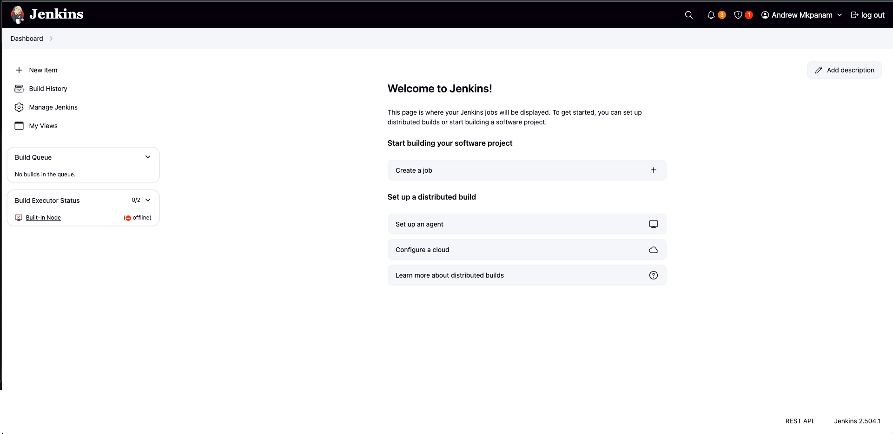
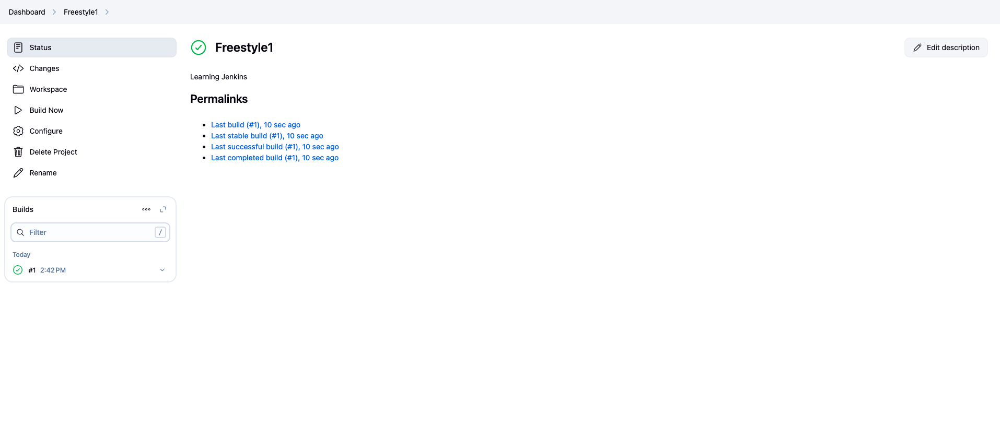

# jenkins2025

## Jenkins Server Setup
### Jenkins Installation

Continuous Integration (CI) and Continuous Delivery/Deployment (CD) are foundational practices in modern DevOps workflows. CI involves developers frequently integrating code into a shared repository, triggering automated builds and tests to detect issues early. CD extends this by automatically delivering or deploying tested code to production or staging environments, ensuring faster and more reliable software releases.

Jenkins is a widely used open-source automation server that plays a crucial role in enabling CI/CD. It allows teams to define custom pipelines (using Jenkinsfiles) that automate building, testing, and deploying software. Jenkins supports integration with various tools like Git, Docker, Maven, and Kubernetes, making it highly flexible in managing end-to-end delivery pipelines.

By automating repetitive tasks and reducing manual intervention, Jenkins enhances the consistency, speed, and quality of software delivery. Its plugin ecosystem and scalability make it a central component in implementing DevOps practices, facilitating continuous feedback and rapid iteration.

In essence, Jenkins is not just a tool for automation—it is a critical enabler of CI/CD pipelines that drive modern, agile, and resilient software development processes.

To Install Jenkins the following steps were taken
1. Spun up an EC2 Server on AWS
2. Allowed Network access to the internet on ports 22, and 8080
3. Updated package reporisoties
4. installed java jdk
5. installed jenkins

6. Connected Jenkins to github account
7. Ran simple freestyle job to demonstrate build

